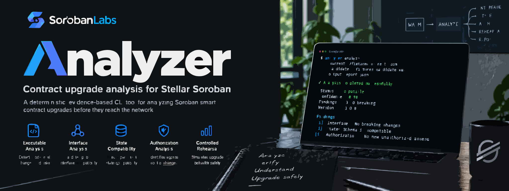

# SorobanLabs Analyzer

<p align="center">
  
</p>

<p align="center">
  <a href="https://github.com/SorobanLabs/sorobanlabs-analyzer/actions/workflows/ci.yml"></a>
  <a href="LICENSE"></a>
  <a href="rust-toolchain.toml"></a>
  <a href="https://github.com/SorobanLabs/sorobanlabs-analyzer/releases/tag/v0.1.0"></a>
</p>

<p align="center">
  <a href="https://sorobanlabs.github.io/sorobanlabs-analyzer/">Documentation</a>
</p>

SorobanLabs Analyzer is a Rust-first analysis tool that answers one
specific question:

> What will change if I replace the executable of this deployed Soroban
> contract?

The analyzer determines what can be established from the available
executable, contract interface, state, authorization surface, and
controlled execution evidence, and reports each finding with an explicit
confidence level. A caller-supplied protocol number is recorded in the
report for context; it is not yet compared against observed environment
interface versions.

## What the analyzer does

- Loads and hashes a current and a candidate contract executable.
- Extracts and normalizes the Soroban contract interface (functions,
  parameters, return types, events, types).
- Diffs the current and candidate interfaces and reports explicit,
  rule-identified findings.
- Represents known contract state and compares state requirements
  between the current and candidate executables.
- Extracts and compares each entrypoint's authorization surface: which
  authorization primitives, if any, it directly calls. This is limited
  to *direct* calls from an entrypoint's own function body; it does not
  trace calls through helper functions, and it never infers a
  principal (which `Address` is being checked) or a signer's identity,
  so "no direct call observed" is not the same finding as "this
  entrypoint is unprotected".
- When given a rehearsal manifest, runs the same invocations against both
  executables under a real, bounded Soroban host backend and reports
  observed behavioral differences (return value, execution outcome).
- Attaches evidence to every meaningful finding.
- Produces a versioned, deterministic canonical JSON report, plus a
  terminal rendering of the same data.

## What the analyzer does not do

- It does not produce a simplistic SAFE/UNSAFE verdict.
- It is not a generic smart contract security scanner or static
  vulnerability scanner.
- It does not duplicate protocol-wide compatibility checking
  responsibilities (that is a separate product's job).
- It does not automatically perform real contract upgrades, submit
  transactions, or execute migrations.
- It does not operate as a hosted service or web dashboard.
- It does not ask for or handle private keys.

## Confidence model

Every meaningful finding uses one of four confidence levels:

- `DETECTED`: the analyzer directly established the condition from
  available evidence.
- `LIKELY`: available evidence strongly indicates the condition, but the
  analyzer cannot establish it with complete certainty.
- `POTENTIAL`: the change could create the condition, but available
  evidence is insufficient to establish the actual impact.
- `NOT_DETERMINABLE`: the analyzer does not have enough information to
  reach a meaningful conclusion.

`NOT_DETERMINABLE` is never treated as a negative finding. Confidence
(how certain the analyzer is) is always reported separately from
severity (how important the condition is if confirmed).

## Analysis status

Top-level analysis status is one of:

- `NO_DETECTED_BLOCKERS`
- `REVIEW_REQUIRED`
- `MIGRATION_REQUIRED`
- `INCONCLUSIVE`
- `ANALYSIS_ERROR`

## Repository layout

```
crates/
  analyzer-core        domain model: errors, findings, confidence,
                       severity, status, upgrade plan
  analyzer-executable   executable loading, WASM inspection, interface diff
  analyzer-state        state snapshots and compatibility analysis
  analyzer-auth         authorization surface extraction and diff
  analyzer-rehearsal    controlled upgrade rehearsal (Soroban host backend)
  analyzer-evidence     evidence model backing findings
  analyzer-report       JSON report and terminal report rendering
  analyzer-cli          command-line interface AND the concrete
                       pipeline orchestration (sequencing calls into
                       the crates above); it lives here, not in
                       analyzer-core, to avoid a dependency cycle,
                       since analyzer-executable/-state/-auth/-report
                       all depend on analyzer-core
fixtures/    declarative fixtures used by the test suite
schemas/     versioned JSON schemas for canonical output
audit/       point-in-time audit reports (see each file's own date
             and HEAD before relying on it; evidence/index.md and
             audit/claim-traceability.md are the current, maintained
             claim surface)
evidence/    the current claim-to-evidence ledger (evidence/index.md)
examples/    real, runnable examples (see examples/README.md)
docs/        source for the published documentation book (see below)
tests/       placeholder at this path: real workspace integration,
             schema, and determinism tests exist under each crate's
             own tests/ directory instead (#13)
scripts/     placeholder: no development or CI helper scripts exist
             yet (#13)
```

`examples/` and `docs/` are populated; `tests/` and `scripts/` remain
intentionally empty placeholders (each README says exactly why). See
[issue #13](https://github.com/SorobanLabs/sorobanlabs-analyzer/issues/13)
for the current state of this work.

## Status

This repository is in early, active development. The analysis pipeline
(executable identity, interface diff, state compatibility, authorization
diff, and controlled rehearsal) and the `analyze` CLI command are
implemented; further CLI commands and report formats are added
incrementally as they are needed.

## CLI usage

```
cargo run -p analyzer-cli -- analyze \
  --current path/to/current.wasm \
  --candidate path/to/candidate.wasm
```

Required: `--current` and `--candidate` (paths to the two executables).

Optional:

- `--protocol <NUMBER>`: the Soroban protocol number to record the
  analysis against.
- `--migration-manifest <PATH>`: an author-supplied migration manifest
  (JSON), treated as a declaration, not proof.
- `--rehearsal <PATH>`: a rehearsal input file (JSON) describing
  invocations to run against both executables under the real
  `soroban-env-host` backend.
- `--format <json|terminal>`: output format; `terminal` (the default)
  prints a human-readable report, `json` prints the canonical report
  (see `schemas/analysis-result.schema.json`).

Exit codes: `0` means the analysis pipeline completed, regardless of the
report's own `status` field (which may be `NO_DETECTED_BLOCKERS`,
`REVIEW_REQUIRED`, `MIGRATION_REQUIRED`, or `INCONCLUSIVE`); a non-zero
code means the CLI itself could not complete (invalid input, a missing
or unreadable file, or an internal analysis failure). Run
`sorobanlabs-analyzer --help` for the full table, or see the
[CLI reference](https://sorobanlabs.github.io/sorobanlabs-analyzer/cli.html)
in the documentation.

## Example

See [`examples/upgrade-review`](examples/upgrade-review/) for a real,
runnable example: two real fixture executables, the exact command, and
the actual captured terminal and JSON output, with an explanation of
each finding.

## Development setup

Install the pinned toolchain (this repository's `rust-toolchain.toml`
pins the exact version, including `rustfmt`, `clippy`, and the
`wasm32v1-none` target used to build test fixture contracts):

```
rustup show
```

Build and test:

```
cargo build --workspace
cargo test --workspace
cargo fmt --all --check
cargo clippy --workspace --all-targets -- -D warnings
```

See [CONTRIBUTING.md](CONTRIBUTING.md) for more detail and
[SECURITY.md](SECURITY.md) for the project's security posture.

## Documentation

The full documentation book is published at
[sorobanlabs.github.io/sorobanlabs-analyzer](https://sorobanlabs.github.io/sorobanlabs-analyzer/),
built from [`docs/`](docs/).

## Maintainer & community

**Maintainer:** [@Hollujay](https://github.com/Hollujay) —
reachable via this repository's GitHub profile, or on Telegram at
[@Hollujay21](https://t.me/Hollujay21). No other official contact
channel is published for this project.

**Community:** there is no dedicated community channel yet.
Contribution and discussion happen through GitHub
[issues](https://github.com/SorobanLabs/sorobanlabs-analyzer/issues)
and pull requests on this repository.

## License

Licensed under the Apache License, Version 2.0. See [LICENSE](LICENSE).
